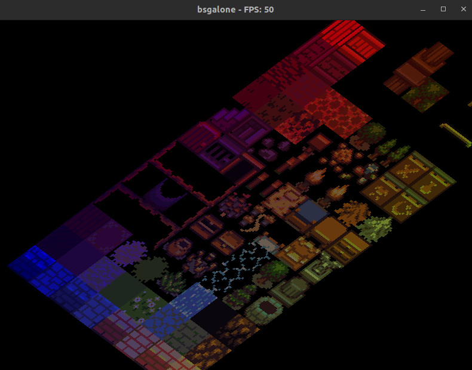
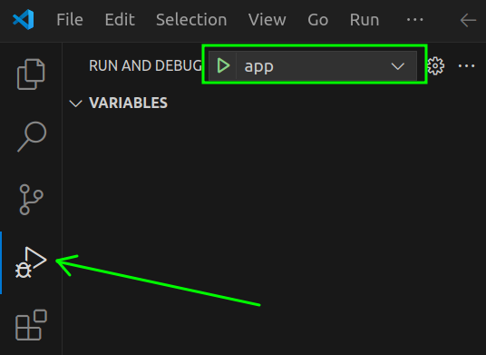

# pge-app

Simple implementation of an application relying on the [PixelGameEngine](https://github.com/OneLoneCoder/olcPixelGameEngine) to perform the rendering. This project comes with a basic event handling system, some basic menus which can register actions and a default `game` structure which can be extended to handle various processes.

It is meant as a simple way to build an application without having to reinvent the wheel for every project. Most of the behaviors can be customized in order to handle more complex behaviors (resources loading, step function, pause system, etc.).

The general architecture of the repository has been inspired by the one described [here](https://raymii.org/s/tutorials/Cpp_project_setup_with_cmake_and_unit_tests.html): this covers how to organize the sources, the headers and the tests.



# Installation

⚠️ The following sections are tailored for an installation on Ubuntu: this is what was used during the development. If you want to try to install this project on another OS it probably works but some of the command will need to be adapted.

## Prerequisites

This projects uses:

- [cmake](https://cmake.org/) as a build management system
- a cpp compiler, typically [gcc](https://gcc.gnu.org/) to build the project
- [eigen](https://eigen.tuxfamily.org/index.php?title=Main_Page) for matrix manipulation
- [google test](https://github.com/google/googletest) as a testing library
- graphical libraries such as `X11`, `GL` and `PNG` for rendering
- [rsync](https://linux.die.net/man/1/rsync) for file management

## TL; DR

For a quick setup, just run the following commands to install all needed dependencies:

```bash
apt update

# Skip this if you already have the basics installed
apt install -y --no-install-recommends \
  cmake \
  build-essential

# To not request information when installing libgl-dev
export DEBIAN_FRONTEND="interactive"

# Those are the dependencies to compile the client and server applications
apt-get install -y --no-install-recommends \
  libeigen3-dev \
  libgtest-dev \
  libx11-dev \
  libgl-dev \
  libpng-dev \
  rsync
```

## Clone and install core_utils

This project requires [core_utils](https://github.com/Knoblauchpilze/core_utils) to be installed on your machine. The project uses most of the same dependencies as this one so with the previous steps performed already you should be able to run:

```bash
git clone git@github.com:Knoblauchpilze/core_utils.git
cd core_utils
make install
```

## Clone the repository

The first step (as is often the case) if you want to work on this project is to clone the repository with:

```bash
git clone git@github.com:Knoblauchpilze/pge-app.git
# Move to the project's folder
cd pge-app
```

## Run the project

With all the steps above completed, you can simply use the convenience `Makefile` target to run the project:

```bash
make run
```

This will take care of building the project and packaging it in a `sandbox` directory with the needed data.

## Configuration

If the user wants to update the project to another name and start with a more complex app, a convenience script is [provided](configureProject.sh) which allows to perform the renaming of elements as needed to have a new app with a different name.

The usage of the script is as follows:

```bash
./configureProject.sh project_name
```

## VSCode integration

### Extensions

In order to make it easy to debug and work on the project directly into the IDE, the following two extensions are recommended:

- [cmake-tools](https://marketplace.visualstudio.com/items?itemName=ms-vscode.cmake-tools)
- [test-mate](https://marketplace.visualstudio.com/items?itemName=matepek.vscode-catch2-test-adapter)

They will respectively help you build the project and debug/start it in your IDE and allow to run and debug tests.

The following sections assume that you installed both.

### Configuration for intellisense

In case you use VScode as an IDE to work on this project, it is recommended to create a `.vscode` folder at the root of the directory. You can then copy past the following configuration in a `c_cpp_properties.json` file:

```json
{
  "configurations": [
    {
      "name": "Linux",
      "includePath": [
        "${workspaceFolder}/**",
        "${workspaceFolder}/src/lib",
        "${workspaceFolder}/src/pge"
      ],
      "defines": [],
      "compilerPath": "/usr/bin/g++",
      "cppStandard": "c++20",
      "intelliSenseMode": "linux-gcc-x64",
      "configurationProvider": "ms-vscode.cmake-tools"
    }
  ],
  "version": 4
}
```

Note that this will require you to have a local `g++` version supporting at least `c++20`.

### Configuration for CMake

The `cmake` tool extension allows to configure a custom build folder and to set arguments for the configure step. In this project we use conditional targets to build the tests: this is activated (as defined in the [Makefile](Makefile)) by the `ENABLE_TESTS` flag.

It is required to instruct the extension to use this flag when configuring the project so that it detects correctly all the target.

You can use the following configuration and paste it in the `.vscode` folder created above under `settings.json`:

```json
{
  "cmake.configureOnOpen": false,
  "cmake.buildDirectory": "${workspaceFolder}/cmake-build",
  "cmake.configureArgs": ["-DENABLE_TESTS=ON"],
  "testMate.cpp.discovery.gracePeriodForMissing": 500,
  "testMate.cpp.discovery.runtimeLimit": 500,
  "testMate.cpp.test.advancedExecutables": [
    {
      "pattern": "cmake-build/**/*{test,Test,TEST}*"
    }
  ],
  "C_Cpp.errorSquiggles": "enabled",
  "C_Cpp.default.compilerPath": "/usr/bin/g++"
}
```

### Launch/debug configuration

In order to run and debug the executables created by the project you can use the following launch configurations: the two configurations will allow to launch the application and debug it directly in the IDE if needed. You can paste the following content in a file under `.vscode/launch.json`:

```json
{
  "version": "0.2.0",
  "configurations": [
    {
      "name": "app",
      "type": "cppdbg",
      "request": "launch",
      "program": "${workspaceFolder}/cmake-build/Debug/bin/pge_app",
      "args": [],
      "stopAtEntry": false,
      "cwd": "${fileDirname}",
      "externalConsole": false,
      "MIMode": "gdb",
      "setupCommands": [
        {
          "description": "Enable pretty-printing for gdb",
          "text": "-enable-pretty-printing",
          "ignoreFailures": true
        },
        {
          "description": "Set Disassembly Flavor to Intel",
          "text": "-gdb-set disassembly-flavor intel",
          "ignoreFailures": true
        }
      ]
    }
  ]
}
```

This should allow you to pick the `Server` configuration win the `RUN AND DEBUG` tab:

// TODO


# Generalities

The application is structured around a base [App](src/lib/App.hh) which can be customized to include more complex behaviors.

## Layers

The rendering is dividied into four layers:

- the debug layer is meant to handle every debug display and can be hidden for increased performance.
- the ui layer receives all the UI information such as menus. Can also be hidden if needed.
- the rendering layer receives any resource that compose the main content of the application.
- the decal layer is meant to receive any GPU accelerated resource.

The ordering of the layer matters as it will describe how elements are overlaid. The order is as follows:

- decal layer
- non-decal graphical resource layer
- ui layer
- debug layer

When pressing the `Shift + D` key the debug layer can easily be toggled on or off. Similarly, `Shift + U` toggles the UI.

## Game

The application provides a base [Game](src/lib/game/Game.hh) class which can be used to wrap the application's data into a structure that can communicate easily with the application. Some general methods have been extracted to provide hooks that are used by the default application to make the game evolve.

While this class is called `Game` it can also receive some other type of data.

Some generic types are also provided to help easily create some menus and UI elements for a game. See more details in the [specialization](#specializing-the-project) section.

## App

The [App](src/lib/App.hh) class is the element which is executed by default when starting the project. It aims at receiving the logic to control the interaction with the user, the rendering and the controlling of the game/app elements.

Multiple hooks are provided where the user can insert custom behavior in order to enrich the base implementation with new processes and features.

## In-app content

The base project comes with a set of basic features to start developing either a game or an app. Some of them are detailed below.

### Creating an App

In order to ease the creation of an `App` object, we regrouped the options within a struct named [AppDesc](src/pge/app/AppDesc.hh). This contains several attributes, among which:

- the dimensions of the window in pixels.
- a coordinate frame (see more details in the dedicated [section](#coordinate-frame)).
- whether or not the view allows panning and zooming.
- an option to throttle the framerate of the application.

### Coordinate frame

Usually, an application maps what happens on the screen to an internal coordinate frame. The start of most interactions begins in pixels frame: the user clicks somewhere or moves the mouse somewhere and we get the information about where the mouse is in pixels. From this, the application needs to transform these coordinates and see if anything interesting happens because of this.

The base app defines a coordinate frame to handle such things. A [coordinate frame](src/pge/coordinates/CoordinateFrame.hh) is an interface which aims at converting the information in pixels space to the internal world space. To do this, it uses two [viewports](src/pge/coordinates/Viewport.hh): one defining the pixels space and the other one the tiles space.

By default, two separate frames are already available:

- a [top view](src/pge/coordinates/TopViewFrame.hh) frame: this represents a simple scaling between the position in pixels and the position in tiles. It can be used for a top down app, or most 2D apps.
- an [isometric view](src/pge/coordinates/IsometricViewFrame.hh) frame: this represents a semi-3D projection which allows to produce graphics like [this](https://en.wikipedia.org/wiki/Isometric_video_game_graphics).

Panning and zooming are handled for both frames, along with converting from pixels to tiles and vice versa.

### Fixing the frame

For some applications, it might be undesirable to have panning and zooming enabled (for example a sudoku app). The `AppDesc` structure allows to configure this through the `fixedFrame` boolean which prevents any panning and zooming to be considered. The application will be blocked on the tiles defined in the main viewport provided when creating the application.

### Limiting the framerate

By default the application will try to run as fast as possible. In case of a very simple rendering process, this can lead to reach framerates of over 200 FPS. This is rarely useful.

The [AppDesc](src/pge/app/AppDesc.hh) provides a way to limit the framerate with the `maxFps` attribute: if it is set, the app will throttle the rendering process to not go over the defined limit. In case the rendering process is becoming too slow to maintain the pace no throttling will happen.

Note that the main thread will then periodically halt to not go over the limit framerate. This means that if another process should be continuously executed, it's better to have a dedicated thread for it.

Finally note that the precision seems to decrease the higher the desired framerate. This might be because of the way we implemented the sleeping time to not sleep below a certain time. Up until 100 fps it works fine though.

### Logging

By default the app comes with a logger allowing to print some messages in the console executing the program. Most of the objects provided in the app are also integrating a logger which makes it possible to debug the processes easily.

In case the user wants to access more log messages or reduce the severity of logs produced by the app, it is easy to adjust the `raw.setLevel` call to not use `Debug` but another level.

### Putting it together

This is the default `main` program provided in this template app:

```cpp
int
main(int /*argc*/, char** /*argv*/) {
  // Create the logger.
  utils::log::StdLogger raw;
  raw.setLevel(utils::log::Severity::DEBUG);
  utils::log::PrefixedLogger logger("pge", "main");
  utils::log::Locator::provide(&raw);

  logger.notice("Starting application");

  /// FIXME: Definition of the viewports: the tiles viewport and the pixels viewport.
  auto tiles  = pge::CenteredViewport({0.0f, 0.0f}, {4.0f, 3.0f});
  auto pixels = pge::TopLeftViewport({0.0f, 0.0f}, {800.0f, 600.0f});

  pge::CoordinateFramePtr frame;
  auto useIsometric = true;
  if (useIsometric)
  {
    frame = std::make_shared<pge::IsometricViewFrame>(tiles, pixels);
  }
  else
  {
    frame = std::make_shared<pge::TopViewFrame>(tiles, pixels);
  }

  pge::AppDesc desc{.dims       = pge::Vec2i{800, 600},
                    .frame      = std::make_unique<pge::IsometricViewFrame>(tiles, pixels),
                    .name       = "pge-app",
                    .fixedFrame = false,
                    .maxFps     = 50};
  pge::App demo(std::move(desc));

  demo.run();

  return EXIT_SUCCESS;
}
```

Both the tiles and pixels viewports are important and define respectively how much of the world will be visible and how zoomed-in the initial setup will be. Also, the user can configure whether an isometric view frame should be used or rather a top view one.

# Profiling

A convenience script is provided in order to profile the app. This comes from [this](https://stackoverflow.com/a/771005) answer (although the other answers are interesting as well). This requires a few things to be installed on the system:

- [GIMP](https://doc.ubuntu-fr.org/gimp)
- [valgrind](https://wiki.ubuntu.com/Valgrind)
- [gprof2dot](https://github.com/jrfonseca/gprof2dot)

The output image is a png that is opened with GIMP and can give ideas about what is slowing down the application.

The profiling can be triggered with the following command:

```bash
make profile
```

# Testing

## Generalities

The default application comes with a functional testing framework. The tests are meant to be located in the [tests](tests/) folder and can be further specialized into unit tests (existing [here](tests/unit) already) but also integration tests, functional tests, etc.

The framework uses the `gtest` library to perform the testing.

The root [CMakeLists.txt](CMakeLists.txt) conditionally compiles the test when required: this means that unless you call one of the `make rununittests` target, the tests won't be compiled. This is mainly useful when building the application in the CI for packaging.

## Adding tests

In order to add a new test, one can create a new file under the relevant test section (say `tests/unit/lib/MyClassTest.cc`). The structure of the file should look something like so:

```cpp

# include "MyClass.hh"
# include <gtest/gtest.h>

using namespace ::testing;

namespace the::namespace::of::the::class {

TEST(Unit_MyClass, Test_MyFeature)
{
  /* FIXME: Some testing. */
  EXPECT_EQ(/* Some condition */);
}

}
```

## Run the tests

Once the tests are written, the root `Makefile` defines a target to execute all the tests under:

```bash
make rununittests
```

If needed new targets can be added with for example integration tests, etc.

# Specializing the project

## Existing structure

The application and the classes within it are designed to easily be reused and extended with various behaviors.

So far, most of the applications we built were structure in a similar way: a bunch of screens representing different information and connected to one another by logical link. For example from the home screen the user can choose to start a new game or load an existing one, and from the game screen it can either transition back to the main screen or exit the application.

This concept is represented in the [Screen](src/lib/game/Screen.hh) enum and can also be thought of as a state machine in a similar fashion as below:


Within each screen, the application does three things:

- process the user input
- render some UI components
- render some graphics

Each of these operation has its dedicated base class in our sample project:

- [IInputHandler](src/lib/inputs/IInputHandler.hh) is responsible to handle user input
- [IUiHandler](src/lib/ui/IUiHandler.hh) is responsible to display the UI
- [IRenderer](src/lib/renderers/IRenderer.hh) is responsible to display the graphics

The classes described above are interfaces that the user can subclass to adapt to their needs.

In order to bring everything together, the [Game](src/lib/game/Game.hh) holds a list of input/ui handlers and renderers. The [App](src/lib/App.hh) is calling at each frame the various hooks of the game to allow the processing of the information. In order each frame will successively:

- process the user input (through the `Game::processUserInput` method)
- process the game logic (through the `Game::step` method)
- render the graphic elements (through the `Game::render` method), which includes both the ui and the renderers

This logic is already provided and should not have to be modified too much from one application to the other. In order to specialize what happens in the application, the user is encourage to:

- adapt the values of the [Screen](src/lib/game/Screen.hh) enum
- subclass [IInputHandler](src/lib/inputs/IInputHandler.hh), [IUiHandler](src/lib/ui/IUiHandler.hh) and [IRenderer](src/lib/renderers/IRenderer.hh) as needed

## IInputHandler

The [IInputHandler](src/lib/inputs/IInputHandler.hh) interface is designed to make interacting with user's input easy. It is called each frame by the `App` to get a chance to process the inputs. It is divided into two main methods: `processUserInput` and `performAction`.

### processUserInput

The prototype looks like the following:

```cpp
virtual void processUserInput(const controls::State &controls, CoordinateFrame &frame) = 0;
```

The [State](src/pge/app/Controls.hh) defines the position of the mouse and the state of the keyboard among other things while the `frame` parameter allows to convert between pixel space to tiles space.

Together these information should be enough to trigger changes based on whether the user hovers over something interesting or presses a key that modifies the state of the game.

### performAction

On top of the `processUserInput` method, we also have the following in the interface:

```cpp
virtual void performAction(float x, float y, const controls::State &controls) = 0;
```

This method is only called when a click was triggered by the user and was not processed by the UI (which would happen if for example the user clicks on a menu). The input coordinates are expressed in tiles space. A typical use of this method is to pick a target in the game world.

## IUiHandler

The [IUiHandler](src/lib/ui/IUiHandler.hh) interface is designed to make it easy to create UI menus in the application. Several method need to be implemented in order to cover all the steps to build a working UI.

Some examples of the specialization can be seen in the [ui](src/lib/ui/) folder: we define some classes to handle the various menus of the sample app.

### initializeMenus

The prototype is as follows:

```cpp
virtual void initializeMenus(const int width,
                             const int height,
                             sprites::TexturePack &texturesLoader)
    = 0;
```

This method is called when the `Game` is first started and should be used by the inheriting classes to setup the UI so that it's ready to be displayed. The dimensions are the dimensions of the window in pixels to allow building somewhat reactive UI. The `texturesLoader` can be used to register some textures used by the UI.

It is okay to not initialize the whole UI just yet (for example if some further information is needed from the game or so): in this case one could create a `m_initialized` boolean which would be used to determine when a certain condition is matched to finish the utilization: for example it could be in a network situation when the data is received from the remote server. While we wait for the initial communication we display some placeholder data or a loading screen for example.

What we expect from this method is to have the ground structure of the UI to be created: for example if a list of items should be built, this method can take care of creating the general layout while initializing the individual elements is delayed for later.

### processUserInput

```cpp
virtual bool processUserInput(UserInputData &inputData) = 0;
```

Similarly to the [IInputHandler](#iinputhandler), the UI needs access to the user's input to update itself: for example change the color of a menu when it is hovered over, or in general detect clicks on button.

This should be handled in this method: we expect the inheriting classes to return a boolean indicating whether the input was relevant for the UI or not. This value is just an indication for the caller.

### render

Perhaps the most important feature of the UI is to display itself so that the user can see it. This is handled by the `render` method:

```cpp
virtual void render(Renderer &engine) const = 0;
```

The method is given in parameter an object to perform the rendering. We can also access the `texturesLoader` which was given in the [initializeMenus](#initializemenus) method to use the textures loaded at that point.

This method should not update the UI but rather display its state to the screen.

### updateUi

The `updateUi` is also called every frame and does not receive any parameter:

```cpp
virtual void updateUi() = 0;
```

Its purpose is to update the UI so that it reflects the data it is supposed to represent. Typically if a button is displaying the name of a character, this method can be used to verify that it's still accurate: if not we can change the UI to match the new value.

In order to update the values we count on the fact that the `IUiHandler` object has some way to access the data it is displaying: this can be achieved for example by giving the necessary objects as arguments when constructing the handler.

### reset

The reset method is not used in the sample project but is designed as a way for the UI to reset its appearance to accomodate for a change in the data. A typical example would be a shop UI if a player logs out, or a mini-map if the level changes: those changes impact quite dramatically the visual of the UI, so much so that it might be a bit too much to expect that the `updateUi` takes care of it.

It can also be used to elaborate on what is described in the [initializeMenus](#initializemenus) section: if the handler has a `m_initialized` boolean, this method can also reset it.

Also worth noting that we also have a `resetUi` method in the `Game` class: this method is not used in the sample app but is meant to reset all the UI handlers for all screens. A typical use case would be to call it on a screen change or in case of a login/logout operation or something similarly important.

## IRenderer

The [IRenderer](src/lib/renderers/IRenderer.hh) interface is supposed to handle the rendering of the graphic resources needed to display the game. This is most easily defined by a negative statement: everything that is not UI. This can be the terrain, the NPCs and player characters in the game, etc. The interface offers the following methods:

```cpp
virtual void loadResources(int width, int height, sprites::TexturePack &texturesLoader) = 0;
virtual void render(Renderer &engine,
                    const RenderState &state,
                    const RenderingPass pass) const = 0;
```

Some examples of the specialization can be seen in the [renderers](src/lib/renderers/) folder: we define some classes to handle the game screen of the sample app. We could also add some renderers to show a prettier background in the other menus for example.

### loadResources

In a similar way to how the [IUiHandler](#iuihandler) is built, the renderer might need to load some resources to properly display its content: this could for example be textures used to represent the player or the NPCs.

This method is passed the dimensions of the window in pixels and a way to register textures. It is called once per renderer at the beginning of the game, before the first frame is displayed.

### render

This method is supposed to perform the rendering and is called by the game once per frame. It is given as argument an engine and a [RenderState](src/pge/app/RenderState.hh): this object is supposed to help determining if a specific game element is visible and should be displayed or not.

Additionally we also have a rendering pass as argument: this helps determining what we want to display. In complex applications this state enumeration could also be enriched with for example rendering pass for the effects, for the particles, etc.

### A word on textures

When manipulating graphic elements, most applications should use the [IRenderer](#irenderer) mechanism. Sometimes, it is desirable to load textures from the file system to be used to display some prettier elements. This can be achieved in the `loadResources` method like so:

```cpp
const auto TILE_SIZE_IN_PIXELS = 64;

const sprites::Pack pack{
  .file = "data/img/pieces.png",
  .sSize = olc::vi2d(TILE_SIZE_IN_PIXELS, TILE_SIZE_IN_PIXELS),
  .layout = olc::vi2d(6, 2)
};

m_texturesPackID = texturesLoader.registerPack(pack);
```

It is important to keep track of the identifier return by the `texturesLoader` as this will be used later on to reference the texture pack. For example to render one of the texture loaded in the pack, the user can sue the `render` method in the following way:

```cpp
SpriteDesc t;
t.xTiles = xPos;
t.yTiles = yPos;

t.radius = 1.0f;

t.sprite.pack   = m_texturesPackID;
t.sprite.sprite = {x, y};
t.sprite.tint   = colors::BLUE;

engine.drawWarpedSprite(t, state.frame);
```

The `xTiles` and `yTiles` coordinates represent the position of the sprite in the world while the `x` and `y` represent the position of the sprite in the textures pack. The engine in the `render` method provides a couple of variation to draw sprites in various ways: it covers the basic cases but can be expected as needed.

## The App class

The [App](src/lib/App.hh) class should not be modified by most application: its role is to make the connection between the execution framework provided by the [PGEApp](src/pge/app/PGEApp.hh) and the [Game](#the-game-class).

To achieve this, we mainly forward the calls for the various steps of the application's game loop (inputs processing, rendering, etc.) to the game. It also takes care of adding a little bit of context in the form of the position of the window and a display of the cursor. Those are mainly development hints and can be removed if unnecessary.

One important mission is to handle the end of life of the application: when the user requests to terminate the app. The `App` class should specialize the `onFrame` method which returns a boolean: this boolean indicates whether we should continue to run the application or not. In general the code looks like this:

```cpp
bool App::onFrame(const float elapsedSeconds)
{
  if (m_game == nullptr)
  {
    return false;
  }

  if (!m_game->step(elapsedSeconds))
  {
    info("This is game over");
  }

  return m_game->terminated();
}
```

The `App` class relies on the `terminated` method of the `Game` to define this.

## The Game class

The [Game](src/lib/game/Game.hh) class provides a context to handle the execution of the code related to the game. The game is a bit of a blanket for the app specific logic. In the case of a sudoku app it can mean handling the verification to place a digit. In the case of a real game it can mean running the simulation and moving entities around.

### Philosophy of the class

The sample class already comes with a `State` and a set of renderers, UI and inputs handlers. The idea behind it is that for each screen, the user can specialize which of the three elements are needed and instantiate them with custom types.

The game class is already wired to then select automatically the right handler based on the current screen.

### How to extend the class

What is not yet provided in the sample app is the actual game data. This can be anything but most of the time for local applications it will take the form of a `World` class which defines whatever is happening in the game world. This class would naturally fit in the `Game`.

It is relatively straightforward to add new renderers or handlers for screens: the user just needs to add the corresponding call to register the new handlers in either `generateRenderers`, `generateInputHandlers` or `generateUiHandlers`. They will automatically be called at the right stage by the `Game`.

### The main loop

Each frame the `App` calls the `step` method of the `Game`. This method is defined in the sample app as:

```cpp
bool Game::step(float /*elapsedSeconds*/)
{
  const auto it = m_uiHandlers.find(m_state.screen);
  if (it != m_uiHandlers.end())
  {
    it->second->updateUi();
  }

  return true;
}
```

The method can be extended with other processes which need to be called on each frame: a world simulation, some network connection handling, etc. It is important to note that this method is synchronous with the rendering which means that any blocking/heavy operations done here will impact negatively the framerate. For a simple application it can be enough to just put processing here but if it becomes too complex it probably makes sense to resort to a more complex asynchronous system where the world has an execution thread separated from the actual execution of the rendering loop.

## A note on the UI

Over in the [ui/menus](src/lib/ui/menus/) folder the sample project already defines a basic system to represent menus. Several base block of a UI are there:

- a generic menu which provides general behavior for highlight, visibility, events propagation and layout and allows nesting.
- a text menu which builds on the generic menu to add the display of a text on the menu.
- a timed menu which is just a menu staying visible for a period of time before disappearing.

We also define some convenience methods in [ScreenCommon](src/lib/ui/common/ScreenCommon.hh) allowing to generate generic menus like a colored menu with a certain size, or a screen option which is used in the sample app to present the options in the various screens (home screen, etc.).

### Configuration

The existing system is designed to be quite versatile through a configuration paradigm: there are several configuration for the two main kind of menus defined ([general config](src/lib/ui/menus/MenuConfig.hh), [background config](src/lib/ui/menus/BackgroundConfig.hh) and [text config](src/lib/ui/menus/TextConfig.hh)). Each configuration define some properties to specialize the base behavior of the menu.

For example the `MenuConfig` is defined like so:

```cpp
struct MenuConfig
{
  Vec2i pos{};
  Vec2i dims{10, 10};

  MenuLayout layout{MenuLayout::VERTICAL};

  bool visible{true};
  bool highlightable{true};
  bool propagateEventsToChildren{true};
  bool expandChildrenToFit{true};

  std::optional<HighlightCallback> highlightCallback{};
  std::optional<ClickCallback> clickCallback{};
  std::optional<LostFocusCallback> lostFocusCallback{};
  std::optional<GameCallback> gameClickCallback{};

  /// @brief - Define when the custom rendering method is called. The two values
  /// correspond to either before or after the main menu rendering method. This
  /// allows inheriting classes to configure how their own rendering logic is
  /// interacting with the base rendering logic.
  CustomRenderMode customRenderMode{CustomRenderMode::POST_RENDER};
};
```

The default values define a visible highlightable menu with no action. The user can very easily configure what happens when this menu is being clicked or change the way it reacts to user input. `BackgroundConfig` fills a similar purpose to define the color that a menu has, and `TextConfig` to configure the behavior of the text of a `UiTextMenu`.

It is quite easy to specialize the behavior of a menu by inheriting from the base class in case the configuration possibilities are not enough for a project.

### Callbacks

One important distinction is the `clickCallback` versus the `gameClickCallback`.

The former is meant as a generic callback to perform an action when the menu is clicked. This usually works for example when a UI handler wants to perform an internal change when one of its component is modified.

The latter on the other hand is collected when the `processUserInput` method is called and, after all relevant UI handlers have been called, is applied to the `Game`.

A typical example to use the game callback for is to change screen: in this case we don't want to notify the UI handler but rather the game that the screen should be changed (see [the dedicated section](#adding-new-screens)).

In general, the user can always create a public method on the `Game`, say `Game::foo` and then attach a callback to the menu like so:

```cpp
const MenuConfig config{
  .gameClickCallback = [](Game& g) {
    g.foo();
  }
};
```

### Lifecycle

Worth noting as well is that we define a `UiMenuPtr` as a unique pointer: this is to encourage unique ownership of menus. Most of the time, the user do not need to keep track of the menus once they are added to the hierarchy: the [UiMenu](src/lib/ui/menus/UiMenu.hh) class manages its children by itself. The only case where it's interesting is when a menu needs to be updated with some information from the game. In this case it is recommended to use the following idiom:

```cpp
auto menu = std::make_unique<UiMenu>(config, bg);
auto menuToKeepForUpdate = menu.get();
parent->addMenu(std::move(menu));
```

In case a menu should perform an action, the concept of callbacks should be enough to automatically trigger when the menu changes its state.

## An application as a state machine

The application can be seen as a state machine which can transition to various screens based on the actions of the user.

Whenever a screen is selected, the `Game` updates the handlers which are attached to the current one: this makes sure that only the relevant processes will get a chance to be executed.

### Adding new screens

It might be useful to create new screens: for example in a chess app, we might want to add some screens corresponding to selecting the difficulty of the AI or which color to play. To do so, the first step is to add a value in the enumeration and then generate the corresponding handlers (for inputs, ui and rendering).

When generating the menu which allow to transition from a screen to another, one can add transition like so:

```cpp
const MenuConfig config{
  .gameClickCallback = [](Game& g) {
    g.setScreen(Screen::YOUR_NEW_SCREEN);
  }
};
```

The rest of the application should behave correctly as long as the transitions are properly wired.

### Default journey in the app

Most applications start on the home screen:


From there the user can select a new game:


This view is empty (outside of the default texture pack) in the default application and display the debug layer. The user can freely refine it by adding menus and displaying the actual content of the game.

Finally the user can select to load an existing 'game' (whatever it can mean):


### Saved games

We provide a skeleton workflow to handle saved games. By default the [LoadGameScreenUiHandler](src/lib/ui/LoadGameScreenUiHandler.hh) has an attribute called `m_savedGames` which allows to perform the generation of a menu to present the saved games to the user.

The configuration includes:

- how many games should be displayed in a single page
- the directory where saved games should be fetched
- the extension of the files defining saved games

Once the user picks a saved game, we call a method on the game (`onSavedGameSelected`) with the name of the file picked by the user:

```cpp
void Game::onSavedGameSelected(const std::string &filePath)
{
  info("Picked game \"" + filePath + "\"");
  setScreen(Screen::GAME);
}
```

This should be a trigger to load whatever content is in this file and update the game. In the sample project the game is automatically transitioning to the `GAME` screen without processing the file. This can be changed easily.
