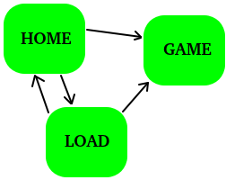
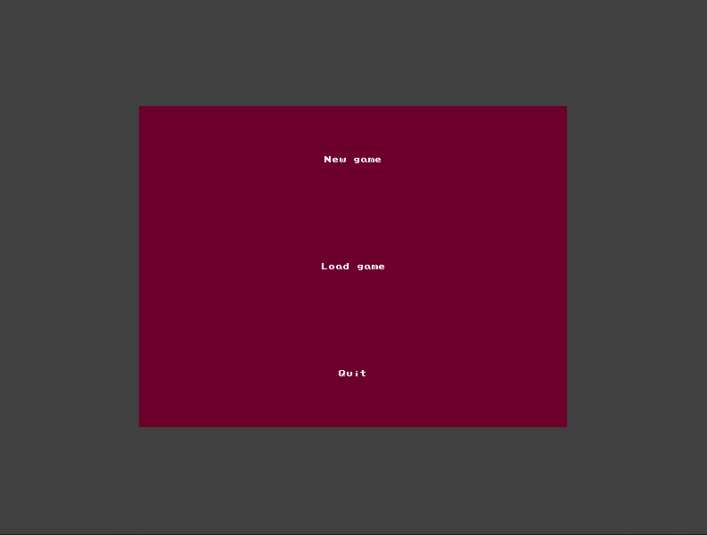
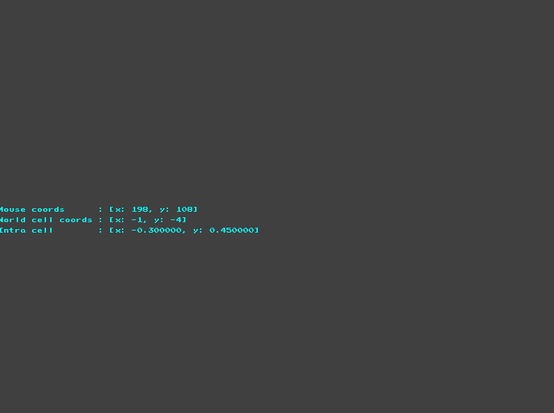
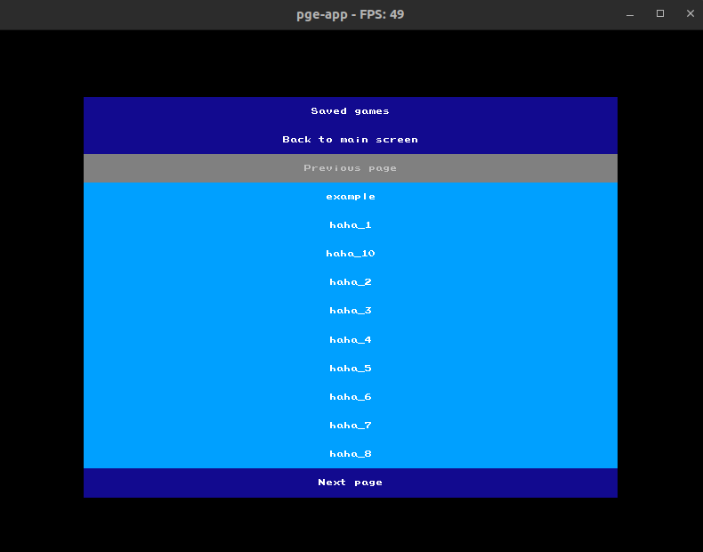

# pge-app

Simple implementation of an application relying on the [PixelGameEngine](https://github.com/OneLoneCoder/olcPixelGameEngine) to perform the rendering. This project comes with a basic event handling system, some basic menu which can register actions and a default `game` structure which can be extended to handle various processes.

It is meant as a simple way to build an application without having to reinvent the weel for every project. Most of the behaviors can be customized in order to handle more complex behaviors (resources loading, step function, pause system, etc.)

# Installation

- Clone the repo: `git clone git@github.com:Knoblauchpilze/pge-app.git`.
- Clone dependencies:
    * [core_utils](https://github.com/Knoblauchpilze/core_utils)
    * [maths_utils](https://github.com/Knoblauchpilze/maths_utils)
- Go to the project's directory `cd ~/path/to/the/repo`.
- Compile: `make run`.

Don't forget to add `/usr/local/lib` to your `LD_LIBRARY_PATH` to be able to load shared libraries at runtime. This is handled automatically when using the `make run` target (which internally uses the [run.sh](data/run.sh) script).

If the user wants to update the project to another name and start with a more complex app, a convenience script is [provided](configureProject.sh) which allows to perform the renaming of elements as needed to have a new app with a different name.

The usage of the script is as follows:
```bash
./configureProject.sh project_name
```

# Profiling

A convenience script is provided in order to profile the app. This comes from [this](https://stackoverflow.com/questions/375913/how-can-i-profile-c-code-running-on-linux) topic. This requires a few things to be installed on the system:
* GIMP
* valgrind
* [gprof2dot](https://github.com/jrfonseca/gprof2dot)

The output image is a png that is opened with GIMP and can give ideas about what is slowing down the application.

The profiling can be triggered with the following command:
```bash
make profile
```

# Usage

The application is structured around a base [App](src/App.hh) which can be customized to include more complex behaviors.

## Layers

The rendering is dividied into four layers:
* the debug layer is meant to handle every debug display and can be hidden for increased performance.
* the ui layer receives all the UI information such as menus. Can also be hidden if needed.
* the rendering layer receives any resource that compose the main content of the application.
* the decal layer is meant to receive any GPU accelerated resource.

The ordering of the layer matters as it will describe how elements are overlaid. The order is as follows:
* decal layer
* non-decal graphical resource layer
* ui layer
* debug layer

## Game

The application provides a base [Game](src/game/Game.hh) class which can be used to wrap the application's data into a structure that can communicate easily with the application. Some general methods have been extracted to provide hooks that are used by the default application to make the game evolve.

While this class is called `Game` it can also receive some other type of data.

## General structure of the application

The application and the class within it are designed to easily be reused and extended with various behaviors.

The classes which should be changed by the user are mainly:
* [App](src/game/App.hh) class
* [Game](src/game/Game.hh) class
* [GameState](src/game/GameState.hh) class

### The App class

The `App` class provides various methods which can be enriched with behaviors.

```cpp
void
App::loadResources() {
  info("Load app resources in the 'm_packs' attribute");
}
```

The `loadResources` method can be used to load the graphic resources needed by the `App`. This includes textures, sprites or any sort of graphic elements. A typical example could look like this:

```cpp
void
App::loadResources() {
  // Create the texture pack.
  pge::sprites::Pack pack;
  pack.file = "data/img/pieces.png";
  pack.sSize = olc::vi2d(TILE_SIZE, TILE_SIZE);
  pack.layout = olc::vi2d(6, 2);

  m_piecesPackID = m_packs->registerPack(pack);
}
```
The `m_piecesPackID` defines an identifier which can then be used to reference a textures pack during the rendering phase (see the `drawDecal`) section.

```cpp
void
App::loadMenuResources() {
  // Generate the game state.
  m_state = std::make_shared<GameState>(
    olc::vi2d(ScreenWidth(), ScreenHeight()),
    Screen::Home
  );

  m_menus = m_game->generateMenus(ScreenWidth(), ScreenHeight());
}
```

The `loadMenuResources` main goal is to create the `GameState` and the UI menus. When debugging the application or during the development process, it might be useful to change the `Screen::Home` statement to `Screen::Game` for example to avoid having to select each time a new game.

```cpp
void
App::drawDecal(const RenderDesc& /*res*/) {
  // Clear rendering target.
  SetPixelMode(olc::Pixel::ALPHA);
  Clear(olc::VERY_DARK_GREY);

  // In case we're not in the game screen, do nothing.
  if (m_state->getScreen() != Screen::Game) {
    SetPixelMode(olc::Pixel::NORMAL);
    return;
  }

  /// FIXME: Add rendering code here.

  SetPixelMode(olc::Pixel::NORMAL);
}
```

The `drawDecal` method should be the preferred way to render complex elements. Using the `Decal` mechanism provided by the `Pixel Game Engine` we are able to render very quickly a lot of elements without impacting the framerate too much.

The method is already set up so that the user can just insert code in the `FIXME` statement (which doesn't exist in the code). It is recommended to use a new method like `drawBoard`, `drawElements` etc. and perform the rendering there.

Whenever the user needs to perform the rendering of sprites, we define a convenience structure to help with drawing that:

```cpp
namespace sprites {
  struct Sprite {
    // The `pack` defines the identifier of the pack from
    // which the sprite should be picked.
    unsigned pack;

    // The `sprite` defines an identifier for the sprite. The
    // position of the sprite in the resource pack will be
    // computed from this identifier.
    olc::vi2d sprite;

    // The `id` allows to select a variant for the sprite. By
    // default this value is `0` meaning the principal display
    // for the sprite.
    int id;

    // The `tint` defines a color to apply to tint the sprite
    // as a whole. Can also be used to provide some alpha.
    olc::Pixel tint;
  };
}

struct SpriteDesc {
  // The x coordinate of the sprite.
  float x;

  // The y coordinate of the sprite.
  float y;

  // The radius of the sprite: applied both along the x and y
  // coordinates.
  float radius;

  // The relative position of the sprite compared to its
  // position.
  RelativePosition loc;

  // A description of the sprite.
  sprites::Sprite sprite;
};
```

These structures help encapsulate the logic to find and draw a sprite at a specific location on screen. An example code is provided below:

```cpp
void
App::drawPieces(const RenderDesc& res) noexcept {
  SpriteDesc sd = {};
  sd.loc = pge::RelativePosition::Center;
  sd.radius = 0.9f;

  for (unsigned y = 0u ; y < 8u ; ++y) {
    for (unsigned x = 0u ; x < 8u ; ++x) {
      sd.x = x;
      sd.y = y;

      sd.sprite.pack = m_piecesPackID;
      sd.sprite.id = 0;
      sd.sprite.tint = olc::WHITE;
      sd.sprite.sprite = olc::vi2d(
        /** FIXME: determine the sprite index **/,
        /** FIXME: determine the sprite variation **/
      );

      drawSprite(sd, res.cf);
    }
  }
}
```
The code above performs the rendering of a 8x8 square of sprites taken from the pack loaded in the example above. The part to determine the index of the sprite based on the element to display is left to the user: it could come from fetching the particular element at this coordinate in the world or determined at random or anything else.

The `drawSprite` method expects the coordinates to be expressed in world coordinates and will automatically convert them in pixels coordinates based on the current position of the viewport in the world.

```cpp
bool
App::onFrame(float fElapsed) {
  // Handle case where no game is defined.
  if (m_game == nullptr) {
    return false;
  }

  if (!m_game->step(fElapsed)) {
    info("This is game over");
  }

  return m_game->terminated();
}

void
App::onInputs(const controls::State& c,
              const CoordinateFrame& cf)
{
  /* ... */
  if (c.keys[controls::keys::P]) {
    m_game->togglePause();
  }
}
```
The scheduling of the `App` include a main loop which is called by the parent `PGEApp` at each frame and an event processing method.

Both these methods are supposed to handle respectively the rendering processes and the input processing code.

The user can easily add hot keys through the [Keys](https://github.com/Knoblauchpilze/pge-app/blob/master/src/app/Controls.hh) enumeration: specific processes can then be triggered when the key is pressed. Note that the code in the [PGEApp::handleInputs](https://github.com/Knoblauchpilze/pge-app/blob/master/src/app/PGEApp.cc) method should also be updated to detect the key being hit or released.

#### The Game class

The `Game` class provides a wrapping context to handle the execution of the code related to the specific code of the application. This is where the user should insert the specific processes and behaviors that the App should process.

```cpp
bool
Game::step(float /*tDelta*/) {
  // When the game is paused it is not over yet.
  if (m_state.paused) {
    return true;
  }

  info("Perform step method of the game");

  updateUI();

  return true;
}
```

The main method is probably `step` where the user can perform the update of the elements that will be added to the `Game` class. This can include a `World` class for example which would be responsible for the simulation. The user is given the elapsed time since the last frame in seconds.

It is usually recommended to convert that to an internal `frame ID` which represents the number of steps that have been executed since the start of the simulation. It also plays nicely with the `Pause` mechanism: we just have to resume the frames and not consider how much time has passed for dynamic processes.

```cpp
void
Game::updateUI() {
  info("Perform update of UI menus");
}
```

The `updateUI` method allows to perfor the update of the menus which content might vary based on the state of the simulation: this could be the number of lives remaining for the user, the amount of a certain resource, etc. This method is called by the `step` method whenever the game is not paused.

```cpp
std::vector<MenuShPtr>
Game::generateMenus(float /*width*/,
                    float /*height*/)
{
  info("Generate UI menus here");
  return std::vector<MenuShPtr>();
}
```
The `generateMenus` class is called by the `App` class and is supposed to create the menus to display when the user is on the `Game` screen. Any menu returned here will be automatically considered by the `App` framework and passed on events in case they are relevant.

The method is passed on the width and height of the rendering canvas which can help adapt the size of the menus to the actual size of the application.

The `Game` class also defines an internal convenience structure to regroup all the menus that might be needed by the `App`:

```cpp
/// @brief - Convenience structure allowing to regroup
/// all info about the menu in a single struct.
struct Menus {
  /// FIXME: Add menus here.
};
```
The user can add all the menus that are needed here to keep the number of attributes to a minimum.

**NOTE:** all menus do not need to be registered. It is mainly interesting to keep them in case their content needs to be updated (typically a label). Otherwise, the menus will automatically handle the release of their children menus when being destroyed. The concept of actions should also be sufficient to trigger processes on the `Game` (and ultimately on any element of the `Game`) when the user clicks on a [Menu](https://github.com/Knoblauchpilze/pge-app/blob/master/src/ui/Menu.hh).

Each menu created with the [Menu](https://github.com/Knoblauchpilze/pge-app/blob/master/src/ui/Menu.hh) class can be attached an [Action](https://github.com/Knoblauchpilze/pge-app/blob/master/src/ui/Action.hh) which is triggered by the menu whenever it is clicked upon (provided that the menu is `clickable`).

Such an action is defined as follows:
```cpp
bool clickable = true;
pge::MenuShPtr m = std::make_shared<pge::Menu>(/* arguments */, clickable, /* arguments */);
m->setSimpleAction(
  [/* optional capture of variables */](Game& g) {
    /// FIXME: Call any method of the game.
  }
);
```
The action receives a reference to the game and can trigger an action on it. A typical use case is to create a public method in the `Game` class (say `Game::foo`) and then have it called by the simple action. This could be for example the creation of a new element, the update of a certain attribute, etc.

Actions can be reset and can also include variables from the context creating it, such as a certain value or a compile time parameter. This mechanism proved quite reliable and easy-to-use to trigger processes on the `Game` from the UI.

Furthermore, the `Game` class defines a convenience internal structure called a `TimedMenu` which allows to display a menu for a certain period of time based on a certain condition.

The user needs to configure the menu and then update its status in the `updateUI` function like so:

```cpp
std::vector<MenuShPtr>
Game::generateMenus(float width, float height) {
  m_menus.timed.date = utils::TimeStamp();
  m_menus.timed.wasActive = false;
  /// NOTE: The duration is expressed in milliseconds.
  m_menus.timed.duration = 3000;
  m_menus.timed.menu = /** FIXME: Generate menu **/
  /// NOTE: Disable the visibility at first if needed.
  m_menus.timed.menu->setVisible(false);

  /* ... */
}

void
Game::updateUI() {
  /* ... */

  m_menus.timed.update(/* Your condition */);

  /* ... */
}
```

This allows to easily display alerts for example, or any information that needs to be presented to the user for a short period of time. Note that it is usually recommended to set the `clickable` and `selectable` flags of the menu attached to the component.

```cpp
void
Game::performAction(float /*x*/, float /*y*/) {
  // Only handle actions when the game is not disabled.
  if (m_state.disabled) {
    log("Ignoring action while menu is disabled");
    return;
  }
}
```
Whenever the user clicks on the game and doesn't target directly a menu, the `Game::performAction` method is called. It is passed on the coordinates of the click in cells using a floating point format (meaning that the `Game` can access the intra-tile position).

By default actions are ignored if the game is disabled: this corresponds to the `Game` being paused. The user is free to add any code to create in-game element whenever the user clicks somewhere.

#### The GameState class

The `GameState` provides the high level state management for the screens of the application. Just like the `Game` class is meant as a wrapper around the world/simulation that the user wants to execute within the application, the `GameState` is meant as a wrapper allowing to control transitions between the load game screen, the home screen and the game screen.

It is possible to add more screens in the application (for example a pause screen, or a selection of properties before entering the new game).

```cpp
GameState::GameState(const olc::vi2d& dims,
                     const Screen& screen):
  utils::CoreObject("state"),

  // Assign a different screen so that we can use the
  // `setScreen` routine to initialize the visibility
  // status of screens.
  m_screen(screen == Screen::Home ? Screen::Exit : Screen::Home),

  m_home(nullptr),
  m_loadGame(nullptr),
  m_savedGames(10u, "data/saves", "ext"),
  m_gameOver(nullptr)
  /** NOTE: Add an attribute for the menu **/
{
  setService("chess");

  generateHomeScreen(dims);
  generateLoadGameScreen(dims);
  generateGameOverScreen(dims);
  /** NOTE: Add a generation method **/

  // Assign the screen, which will handle the visibility
  // update.
  setScreen(screen);

  // Connect the slot to receive updates about saved games.
  m_savedGames.onSavedGameSelected.connect_member<GameState>(this, &GameState::onSavedGamePicked);
}
```
The user is encouraged to create a separate attribute for the new screen, then add a generation function and the corresponding enumeration value in the [Screen](https://github.com/Knoblauchpilze/pge-app/blob/master/src/game/GameState.hh) enumeration.

The rest of the application should behave correctly with the new state, it is up to the user to add the handling of the new state where needed.

The application can be seen as a state machine which can transition to various screens based on the actions of the user.



Most applications start on the home screen:


From there the user can select a new game:


This view is empty in the default application and display the debug layer. The user can freely refine it by adding menus and displaying the actual content of the game.

Finally the user can select to load an existing 'game' (whatever it can mean):


We provide a convenience structure to handle the saved games. By default the `GameState` has an attribute called `m_savedGames` which allows to perform the display and generation of a menu to present the saved games to the user.

The configuration includes how many games should be displayed in a single page, the directory where saved games should be fetched and the extension of the files defining saved games:
```cpp
m_savedGames(10u, "data/saves", "ext")
```

Once the user picks a saved games, a signal is emitted by this object and transmitted to the `GameState` class (the connection is already active). To react to such an event, the user has to elaborate the implementation of the dedicated method:
```cpp
void
GameState::onSavedGamePicked(const std::string& game) {
  info("Picked saved game \"" + game + "\"");
  setScreen(Screen::Game);
}
```
For now nothing is done and the application switches to the `Game` state immediately. A popular way to deal with the loading of a game is to add an internal attribute to the `GameState` class which represents the `Game` (typically a reference) and then call a newly created method such as `loadNewGame(const std::string& file)`. The input attribute `game` is the full path to the saved file data.

The user should also modify the `App::loadMenuResources` method to account for the modified signature of the `GameState` constructor.
```cpp
void
App::loadMenuResources() {
  // Generate the game state.
  m_state = std::make_shared<GameState>(
    olc::vi2d(ScreenWidth(), ScreenHeight()),
    Screen::Home
  );

  m_menus = m_game->generateMenus(ScreenWidth(), ScreenHeight());
}
```

## Convenience options

By default, the application allows the user to pan and zoom in the main game view. While very handy in most situations it can also be that the user wants to create a static application where the mechanism of cells is mostly use to reference cells in a game (similarly to what would happen for a Sudoku game for example).

The [AppDesc](https://github.com/Knoblauchpilze/pge-app/blob/master/src/app/AppDesc.hh) structure allows that through the `fixedFrame` boolean which prevents any panning and zooming to be considered. The application will be blocked on the cells defined in the main viewport provided when creating the application.

The user can also select the initial viewport of the app in the `main` file as presented below:

```cpp
int
main(int /*argc*/, char** /*argv*/) {
  // Create the logger.
  utils::StdLogger raw;
  raw.setLevel(utils::Level::Debug);
  utils::PrefixedLogger logger("pge", "main");
  utils::LoggerLocator::provide(&raw);

  logger.logMessage(utils::Level::Notice, "Starting application");

  /// FIXME: Definition of the viewports: the tiles viewport and the pixel viewport.
  pge::Viewport tViewport = pge::Viewport(olc::vf2d(-6.0f, -5.0f), olc::vf2d(20.0f, 15.0f));
  pge::Viewport pViewport = pge::Viewport(olc::vf2d(10.0f, 50.0f), olc::vf2d(800.0f, 600.0f));

  pge::CoordinateFrameShPtr cf = std::make_shared<pge::TopViewFrame>(
    tViewport,
    pViewport,
    olc::vi2d(64, 64)
    );
  pge::AppDesc ad = pge::newDesc(olc::vi2d(800, 600), cf, "pge-app");
  pge::App demo(ad);

  demo.Start();

  return EXIT_SUCCESS;
}
```

Both the tiles and pixels viewports are important and define respectively how much of the world will be visible and how zoomed-in the initial setup will be.

In case the user wants to access more log messages or reduce the severity of logs produced by the app, it is easy to adjust the `raw.setLevel` call to not use `Debug` but another level.
